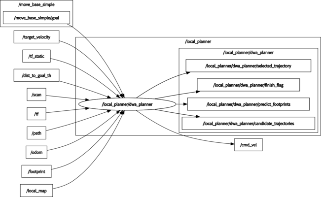

# dwa_planner

[](https://github.com/amslabtech/dwa_planner/actions)
[](https://github.com/amslabtech/dwa_planner/issues?q=is%3Aopen+is%3Aissue)
[](https://github.com/amslabtech/dwa_planner/issues?q=is%3Aissue+is%3Aclosed)

## Overview
ROS implementation of DWA(Dynamic Window Approach) Planner

The API documentation is available at [https://amslabtech.github.io/dwa_planner/](https://amslabtech.github.io/dwa_planner/)

**Note: This simulator is not provided.**


## Environment
- Ubuntu 20.04
- ROS Noetic

## Install and Build
```
# clone repository
cd /path/to/your/catkin_ws/src
git clone https://github.com/amslabtech/dwa_planner.git

# build
cd /path/to/your/catkin_ws
rosdep install -riy --from-paths src --rosdistro noetic # Install dependencies
catkin build dwa_planner -DCMAKE_BUILD_TYPE=Release     # Release build is recommended
```

## 安装依赖
```bash
sudo apt-get install ros-noetic-gmapping
```

## 工作流程

### 1. 使用脚本启动导航系统（无地图模式）

使用提供的一键启动脚本，自动启动SLAM和DWA导航：

```bash
# 为脚本添加执行权限
chmod +x ~/quad/navigation/catkin_MRPB/src/dwa_planner/start_dwa_navigation.sh

# 运行导航脚本
~/quad/navigation/catkin_MRPB/src/dwa_planner/start_dwa_navigation.sh
```

该脚本会自动:
1. 启动SLAM建图节点 (gmapping)
2. 启动DWA局部规划器
3. 设置合适的参数

### 2. 发送导航目标点

启动系统后，使用以下命令发送导航目标点：

```bash
# 为脚本添加执行权限
chmod +x ~/quad/navigation/catkin_MRPB/src/dwa_planner/script/send_goal.py

# 运行发送目标点脚本
rosrun dwa_planner send_goal.py
```

您可以修改`send_goal.py`文件中的目标坐标：
```python
# 在这里设置目标点坐标
target_x = 38.0  # X坐标
target_y = 0.0   # Y坐标
```

### 3. 保存SLAM地图

当机器人完成导航并建图后，使用以下命令保存地图：

```bash
# 为脚本添加执行权限
chmod +x ~/quad/navigation/catkin_MRPB/src/dwa_planner/save_map.sh

# 运行保存地图脚本
~/quad/navigation/catkin_MRPB/src/dwa_planner/save_map.sh
```

这将在指定目录下保存两个文件：
- `mymap.pgm`：地图图像文件
- `mymap.yaml`：地图配置文件

保存位置为：`/home/he/quad/navigation/catkin_MRPB/src/dwa_planner/maps`

### 4. 使用已有地图进行完整导航

获得地图后，可以使用完整导航系统，包含定位、全局规划和局部规划：

```bash
# 启动完整导航系统
roslaunch dwa_planner p3dx_navigation_with_map.launch
```

此模式特点：
- 加载预先生成的地图
- 使用AMCL进行定位
- 包含全局和局部路径规划
- 可用于复杂环境导航
- 支持动态障碍物规避

您可以自定义参数：
```bash
# 指定不同的地图文件
roslaunch dwa_planner p3dx_navigation_with_map.launch map_file:=路径/到/您的地图.yaml

# 指定不同的世界文件
roslaunch dwa_planner p3dx_navigation_with_map.launch world_name:=路径/到/您的世界.world
```

## 其他启动方式

如果您需要更灵活的控制，也可以分步启动各个组件：

### 单独启动SLAM
```bash
# 启动gmapping SLAM
roslaunch gmapping slam_gmapping_p3dx.launch
```

### 单独启动DWA规划器
```bash
# 启动DWA规划器
roslaunch dwa_planner move_base_p3dx_dwa.launch
```

## Running the demo with docker
```
git clone https://github.com/amslabtech/dwa_planner.git && cd dwa_planner

# build an image, create a container and start demo (Ctrl-c: stop a container and exit)
docker compose up
# remove a container
docker compose down
```

## Running the demo without docker
### Using simulator
```
# clone repository
cd /path/to/your/catkin_ws/src
git clone -b noetic-devel https://github.com/ROBOTIS-GIT/turtlebot3_msgs.git
git clone -b noetic-devel https://github.com/ROBOTIS-GIT/turtlebot3.git
git clone -b noetic-devel https://github.com/ROBOTIS-GIT/turtlebot3_simulations.git

# build
cd /path/to/your/catkin_ws
rosdep install -riy --from-paths src --rosdistro noetic
catkin build -DCMAKE_BUILD_TYPE=Release

# run demo
export TURTLEBOT3_MODEL=burger
roslaunch dwa_planner demo.launch
```


## Node I/O


### Published/Subscribed Topics
Access [here](docs/Topics.md)

### Runtime requirement
- TF (from GLOBAL_FRAME to ROBOT_FRAME) is required

## Parameters
Access [here](docs/Parameters.md)

## References
- [D. Fox,  W. Burgard, and S.Thrun, "The dynamic window approach to collision avoidance", IEEE Robotics Automation Magazine, 1997.](https://ieeexplore.ieee.org/abstract/document/580977)
